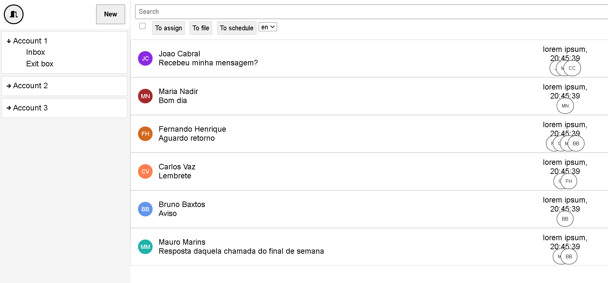

Conclusão do teste de frontend do wiid

Ferramentas, react e typescript

Features

1 - Fazer o login antes de entrar a senha é salva no localstore 
2 - Alterar o idioma clicando no botão pt/en 
3 - O botão arquivar, arquiva as mensagens selecionadas 
4 - Ao passar o mouse na mensagem o icone muda para um input se um input estive selecionado e passar o mouse sobre outra mensagem todas os icones são transformados em input 
5 - Ao clicar no icone da porta o usúario é deslogado 
6 - Se o usúario não estive logado não pode acessar essa pagina e será redirecionado para o login 

 

